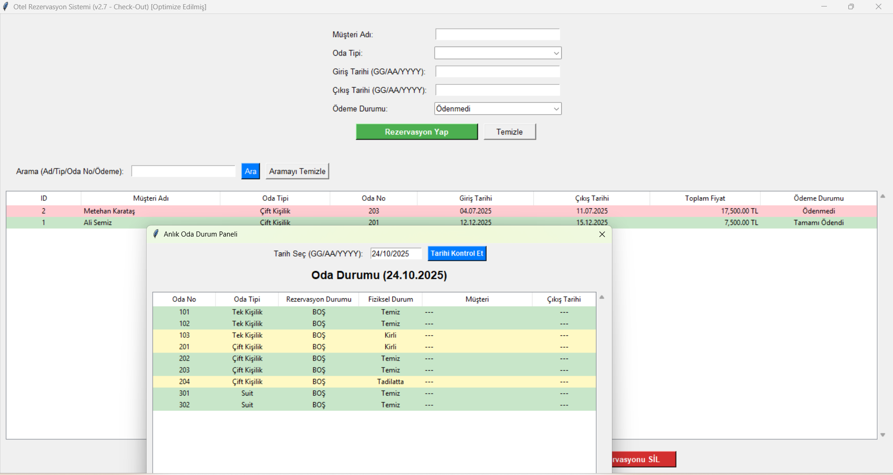

# Otel Rezervasyon Sistemi (Python & Tkinter)

Bu proje, Python programlama dili, Tkinter GUI kütüphanesi ve SQLite veritabanı kullanılarak geliştirilmiş bir masaüstü otel rezervasyon yönetim sistemidir.




## Temel Özellikler

* **Rezervasyon Yönetimi:** Yeni rezervasyon oluşturma, mevcut rezervasyonları görüntüleme, güncelleme ve silme.
* **Oda Yönetimi:** Otel odalarını (numara, tip, günlük fiyat) ekleme, güncelleme ve silme.
* **Kat Hizmetleri:** Odaların fiziksel durumunu (Temiz, Kirli, Tadilatta) takip etme ve güncelleme. Rezervasyon yapılırken sadece 'Temiz' odaların seçilmesi.
* **Ödeme Takibi:** Rezervasyonların ödeme durumunu (Ödenmedi, Kapora Alındı, Tamamı Ödendi) yönetme ve listelemede renkli gösterim.
* **Müsaitlik Kontrolü:** Rezervasyon eklerken veya güncellerken tarih çakışmalarını ve oda durumunu (Temiz mi?) otomatik kontrol etme.
* **Anlık Durum Paneli:** Belirli bir tarihteki tüm odaların rezervasyon durumunu (Dolu/Boş) ve fiziksel durumunu gösteren interaktif panel.
* **Check-Out Otomasyonu:** Seçili bir rezervasyon için tek tuşla check-out işlemi yaparak ödeme durumunu 'Tamamı Ödendi' ve oda durumunu 'Kirli' olarak ayarlama.
* **Arama:** Müşteri adı, oda tipi, oda numarası veya ödeme durumuna göre rezervasyonlar içinde arama yapma.

## Kullanılan Teknolojiler

* **Python 3:** Ana programlama dili.
* **Tkinter:** Grafiksel kullanıcı arayüzü (GUI) için Python'un standart kütüphanesi.
* **SQLite 3:** Verilerin saklanması için kullanılan gömülü veritabanı sistemi.

## Kurulum ve Çalıştırma

1.  **Python 3'ü Yükleyin:** Eğer yüklü değilse, [python.org](https://www.python.org/downloads/) adresinden işletim sisteminize uygun Python 3 sürümünü indirip yükleyin. (Yükleme sırasında "Add Python to PATH" seçeneğini işaretlemeyi unutmayın).
2.  **Dosyaları İndirin:** Bu depodaki `veritabani.py` ve `app.py` dosyalarını bilgisayarınızda aynı klasör içine indirin veya klonlayın.
3.  **Veritabanını Hazırlayın:** Kod, ilk çalıştırmada `otel_rezervasyon.db` adında bir veritabanı dosyasını otomatik olarak oluşturacaktır. Eğer daha önceden kalma bir dosya varsa, tutarlılık için silmeniz önerilir.
4.  **Uygulamayı Çalıştırın:** Komut istemcisini (terminal) proje dosyalarının bulunduğu klasörde açın ve aşağıdaki komutu çalıştırın:

    ```bash
    python app.py
    ```

    *(Eğer sisteminizde hem Python 2 hem de Python 3 yüklüyse ve `python` komutu Python 2'yi çalıştırıyorsa, bunun yerine `python3 app.py` komutunu kullanmanız gerekebilir.)*

## Geliştirme Notları

Bu proje, Tkinter ile masaüstü uygulama geliştirme ve SQLite veritabanı yönetimi pratiği yapmak amacıyla oluşturulmuştur. Kod içerisinde hata yönetimi (try-except blokları), veritabanı bağlantı yönetimi (with blokları) ve temel optimizasyonlara dikkat edilmiştir.
